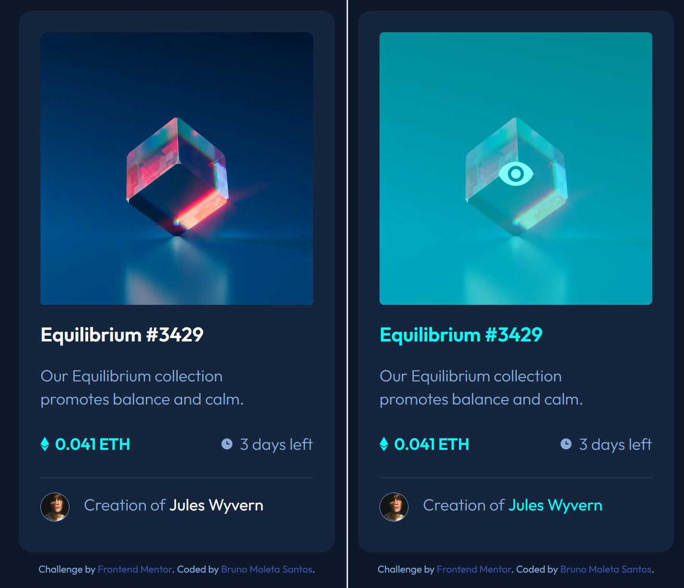

# Project Title

A brief description of what this project does and who it's for:

# Frontend Mentor - NFT preview card component solution

This is a solution to the [NFT preview card component challenge on Frontend Mentor](https://www.frontendmentor.io/challenges/nft-preview-card-component-SbdUL_w0U). Frontend Mentor challenges help you improve your coding skills by building realistic projects.

## Table of contents

- [Overview](#overview)
  - [The challenge](#the-challenge)
  - [Screenshot](#screenshot)
  - [Links](#links)
- [My process](#my-process)
  - [Built with](#built-with)
  - [What I learned](#what-i-learned)
  - [Continued development](#continued-development)
  - [Useful resources](#useful-resources)
- [Author](#author)

**Note: Delete this note and update the table of contents based on what sections you keep.**

## Overview

### The challenge

Users should be able to:

- View the optimal layout depending on their device's screen size
- See hover states for interactive elements

### Screenshot



### Links

- Solution URL: (https://github.com/brunomoleta/animated-guide)
- Live Site URL: (https://brunomoleta.github.io/animated-guide/)

## My process

### Built with

- Semantic HTML5 markup
- CSS custom properties
- Flexbox

### What I learned

This challenge was the first time I separated the css in different files making it more organized.
Building the static card was straightforward with Flexbox.
The difficult part was to make interactive elements change all at once.
To accomplish the task I put
all the elements are linked to the hover of the card (.container), so when this element is hovered everything especified interacts.

```css
.container:hover > #overlay > .img-nft {
  opacity: 0.5;
  border-radius: 0.5rem;
}

.container:hover > #overlay > .img-nft > #view {
  opacity: 1;
}

.container:hover > #overlay > .img-nft > #view,
.container:hover > #overlay > .img-nft {
  transition: opacity 500ms;
}

.container:hover > h1,
.container:hover > .credits > p > .author {
  color: var(--primary-cyan);
}
```

The takeaway from the HTML is where the the 'eye' icon which only appears when the card is hovered is located. Inside the #view.
Its also worth noticing the presence of <hr> that has a semantical meaning of separating content.

```html
    <main>
      <section>
        <div>
          <figure>
            <div id="view">
              
            </div>
            
          </figure>
        </div>
        <h1></h1>
        <p>
        <p>
          <span>
            
          </span>
          <time>
            
          </time>
        </p>
        <hr/>
        <div>
          <figure>
            
          </figure>
          <p>
            <strong>

          </p>
        </div>
      </section>
    </main>

```

### Continued development

Attention to dynamic elements in CSS.

### Useful resources

- [Jad Joubran's HTML/CSS course](https://learnhtmlcss.online/) - Jad Joubran's website is a valuable resource for begginers.
- [Josh Cameau blog](https://www.joshwcomeau.com/) - This website goes deep conceptually an it makes it visual explanations, I believe it's great.

## Author

- Website - [Bruno Moleta Santos](https://www.linkedin.com/in/bruno-moleta-santos/)
- Frontend Mentor - [@brunomoleta](https://www.frontendmentor.io/profile/brunomoleta)
